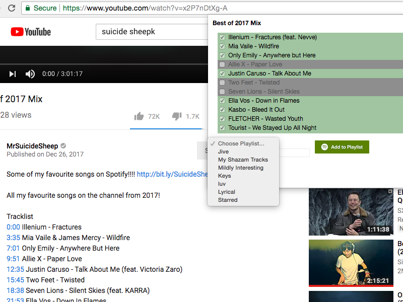

## Overview
I am a Full Stack Developer living in the Bay Area. I love keeping myself up-to-date with the latest front-end technologies and build backends that scale with it.

In fact, when I had first made this website, it was in [AngluarJS](https://angularjs.org/). Later I moved to a minimal [Bulma](https://bulma.io/) framework. Today it uses [Vuepress](https://vuepress.vuejs.org/) deployed on [Netlify](https://www.netlify.com/). If I were to guess, it will probably change again by end of this year.

Below, I have picked a few projects that I have enjoyed working on. Hope you enjoy reading it too.

## Atlas Explorer
<ProjectItem :tags="['VueJS', 'Python', 'Kubernetes', 'MongoDB', 'OpenSource', 'Jest', 'Tox']">
  

    This product startup aimed to present complex geospatial data in easy-to-understand formats of Tables and Maps. I worked as Full Stack Engineer, all the way from the UI in VueJS to the deployment in Kubernetes including the backend in Flask/Python and managing user data in MongoDB. 
      
    I took ownership of the data table component and made a completely in-house open sourced VueJS table component that uses the power of scoped slots. Some of its features are sticky columns, grouped headers and unopinionated styling that allow end-users to customize the look and feel while not sacrificing functionality.
      
    I also handled the Python mini-server code, which would interact with a much larger data API using Keycloak as its authentication mechanism. Consequently, I worked on all the token exchange mechanisms between various clients, Keycloak JavaScript library integration and Keycloak login page theming (using kubernetes init containers managed via Helm and Apache Freemarker).
  

  
</ProjectItem>

## JavaScript RayTracer
<ProjectItem :tags="['ThreeJS', 'AngularJS', 'NodeJS']" url-link="https://github.com/muraliavarma/raytracer_nodejs" url-text="Github">
  

    In this project, I created the rendering pipeline in JavaScript in a single HTML page. The user can change position of object and lights in 3D space through the browser and see results immediately. The steps involved are world transformation, lighting calculation, view transformation, perspective transformation, z-clipping, culling, z-sorting and resterization.
      
    I use a library called Sylvester to do matrix calculations and Raphael for rasterization. The native HTML5 canvas element created blurry lines due to anti-aliasing. In the future, I plan to access pixel data and implement Bresenham's line drawing algorithm to render it in canvas.
      
    Image here shows a screenshot of a 3D plane which is rendered as a series of pixels after going through the rendering pipeline. Click the Live Demo above to play with these values in real time.
  

  
</ProjectItem>

## AWS Services
<ProjectItem :tags="['AWS', 'Lambda Functions', 'Cloudfront', 'EBS']">
  

    Over the last couple of years, I have worked on multiple products within Amazon Web Services.
      
    At SAP.IO, I monitored the usage of our unmanaged Kubernetes Cluster (before EKS) and reduced costs by 60% by downscaling them using kops.
      
    I also worked through the high pressure process of restoring the latest EBS snapshot of an accidentally deleted volume that was attached to a super important EC2 node.
      
    At Zynga, I oversaw the migration plan for moving volatile keys from internal Memcached solution to AWS Elasticache. I also wrote AWS Lambda functions in Python to handle automatic replacement of bad nodes.
  

</ProjectItem>

## YouSpot
<ProjectItem :tags="['AngularJS', 'NodeJS', 'Spotify']" url-link="https://chrome.google.com/webstore/detail/youspot/bojlgkgcbdcldkhjjapllgncgdgalhfj" url-text="Chrome Web Store">
  

    I listen to a lot of YouTube song mixes to discover new music. But of the 20 odd tracks in the video, I usually like only a couple of them. So, I created this chrome extension which parses YouTube page data and adds them to your Spotify playlist of choice.
      
    During this project, I had to find solutions for problems that I had never faced before. Dealing with CORS, especially in the Chrome Extension context was quite chalenging. This was also the first time I had used an OAuth flow (for Spotify Integration).
      
    Image here shows a screenshot of a YouTube page with the YouSpot extension overlaid on the right side. The extension shows the songs that were parsed from the page that match a song name in Spotify. I chose most of the songs (green = selected, grey = unselected) and added them to one of my existing (or new) playlist in Spotify.
  

  
</ProjectItem>

## Slots Challenges
<ProjectItem :tags="['ReactJS', 'Redux', 'PHP']">
  

  Designed and implemented the core logic in PHP for a framework in Zynga Hit It Rich! Slots game that presents players with tasks/challenges which when completed grants them rewards. This has been extended and used for multiple features and events, all configurable from a single feature-rich admin page made in React JS and Redux.
    
  Since these features are timed events, servers were usually under heavy load during this time. To mitigate this, I implemented a caching strategy for storing the latest configuration files in each web server as well as in-memory.
  

  
</ProjectItem>

## Shapes AI Game
<ProjectItem :tags="['Unity', 'AI', 'NodeJS']" url-link="https://github.com/muraliavarma/ShapesAI" url-text="Github">
  

    In this project, we created a game where we controlled a simple shape that required us to solve puzzles. The interesting thing was that some puzzles were only partially solvable by the player, the remaining part required a companion AI.
      
    This AI would analyze the expected final state and the data it has at hand and figure out all possible ways in which it can succeed and then use the most optimal solution. If player changes state during this time, the AI would recompute its state.
      
    Image here shows a screenshot of the player shape on its route to solve one of the puzzles. After this, the AI would have gone on to solve the rest of the puzzle
  

  
</ProjectItem>

## Kinect Soccer
<ProjectItem :tags="['C++', 'MS Kinect', 'OpenGL']">
  

    This is a graduate special problem that I did to track finger position using Microsoft Kinect (and OpenNI) and simulate soccer with it. Fingers are tracked using their position in 3D space (with depth information tracked by Kinect IR sensors). The slope of fingers is calculated in XY and YZ planes by approximation of an over-constrained problem.
      
    This is then rendered in 3D through OpenGL. One of the challenges that I faced was that the Kinect provided gave high confidence values to depth information. I had to use neighboring pixel values to calculate my own confidence values so as to reduce jittering.
      
    Image here shows a screenshot of the different states by which the RGB and depth info of the fingers is translated into fake legs in the 3D world
  

  
</ProjectItem>

## JS Rendering Pipeline
<ProjectItem :tags="['JavaScript', 'Rendering']">
  

    In this project, I created the rendering pipeline in JavaScript in a single HTML page. The user can change position of object and lights in 3D space through the browser and see results immediately. The steps involved are world transformation, lighting calculation, view transformation, perspective transformation, z-clipping, culling, z-sorting and resterization.
      
    I use a library called Sylvester to do matrix calculations and Raphael for rasterization. The native HTML5 canvas element created blurry lines due to anti-aliasing. In the future, I plan to access pixel data and implement Bresenham's line drawing algorithm to render it in canvas.
      
    Image here shows a screenshot of a 3D plane which is rendered as a series of pixels after going through the rendering pipeline. Click the Live Demo above to play with these values in real time.
  

  
</ProjectItem>

## Forest L-System
<ProjectItem :tags="['ThreeJS', 'JavaScript', 'L-System']" url-link="https://github.com/muraliavarma/forest_lsystem" url-text="Github">
  

    In this project, we created different types of tree structures using L-systems. In a forest, many such trees compete for light and fight against gravity (resulting in sagging trees due to "geotropism")
      
    We used Three.js for rendering the forest and a Turtle to draw the trees using grammar rules from the L-system theory.
      
    Image here shows a screenshot of a snapshot of the forest after a few iterations of randomized seed distribution. Redder colors are older trees and generally taller. They grow and die, leaving the younger ones to thrive after a certain time, resulting in a very dynamic environment. Try out the Live Demo link above to see it in action
  

  
</ProjectItem>

## Network Bandwidth Visualization
<ProjectItem :tags="['Flash', 'Network']">
  

    A huge network of routers had to be built for live TV feed transmission from different stadiums during the Commonwealth Games. The tool that I developed helped identify suitable positions for backup links, bandwidth utilization of every link and points of failure in the network. It also helped track primary and backup paths of individual TV feeds and provided a simple interface to monitor large amounts of live information in a browser window.
      
    Image here shows a screenshot of data for one stadium. The color of the line between two routers represents the average utilization of all the links in that bundle, while feed paths are shown in glowing colors. The selected bundle contains 3 links, one of which carries the blue feed as shown in the table.
  

  
</ProjectItem>
